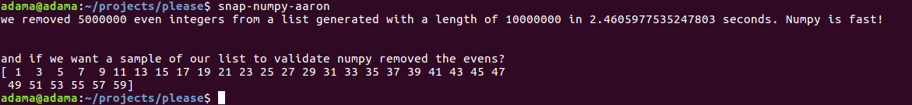

# Snap and Numpy demo

This program generates a massive list with list comprehension and numpy. 
It then generates a list of all the evens in that list with list comprehension.
Finally, to show the power of numpy, we remove all the evens in a timely fashion.
Normally, this would kill python.  



## Getting Started

In order to get started using this tool, you will need to configure a new Ubuntu Desktop 16.04 LTS 
and setup your virtual environment.

```
$ sudo apt-get install python3-venv
$ mkdir <location of venvs>
$ python3 -m venv <ex. snap_ex>
$ source <snap_ex>/bin/activate
```

### Prerequisites
Only use 16.04LTS, 18 has linker issues

### Installing
Go ahead and do yourself a favor and do the following first two commands. trust me
```
$ sudo apt install snapcraft
$ sudo apt install snapd
$ sudo git clone https://github.com/varUP/snap_numpy_demo_aaron.git
```
Make a new DIR and copy yaml file AFTER you `git init` on the new DIR. 
Once complete:
```
$ sudo snapcraft prime
$ sudo snap try --devmode prime/
$ snap-numpy-aaron
```

## Version

Version 1.0

## Lessons learned

always always always always use a shebang with snap

## Authors

* **Aaron Reyna**
